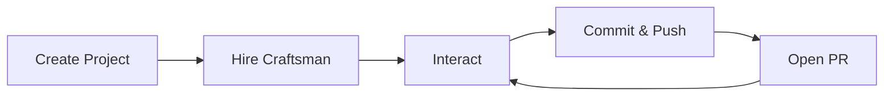
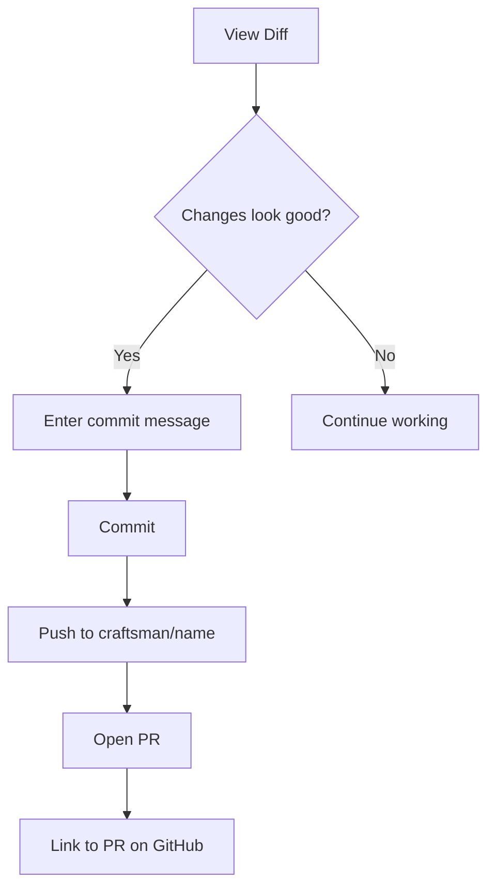

## Overview

The development loop in Workshop follows this pattern:

1. **Create a Project** — point Workshop at a GitHub repo
2. **Hire a Craftsman** — spin up an isolated container
3. **Interact** — use the terminal, give instructions, preview running services
4. **Ship** — commit, push, and open a PR



## Step 1: Create a Project

In the Workshop UI, go to **Settings** and create a new Project. Provide:

- **Name** — a short identifier (e.g. `my-app`)
- **Repo URL** — the GitHub HTTPS URL
- **Branch** — which branch to clone (default: `main`)
- **Setup command** — runs after cloning (e.g. `npm install`)
- **Ports** — container ports to expose (e.g. `3000` for a dev server)
- **GitHub token** _(optional)_ — needed for private repos and PR creation

Or via the API:

```bash
curl -X POST http://localhost:7424/api/projects \
  -H "Content-Type: application/json" \
  -d '{
    "name": "my-app",
    "repo_url": "https://github.com/user/repo",
    "setup_cmd": "npm install",
    "ports": [3000]
  }'
```

## Step 2: Hire a Craftsman

Click **New Craftsman** in the sidebar, pick a name and project. The Craftsman will move through `starting` → `running` as it:

1. Creates a Docker container
2. Clones the repo to `/workspace/project`
3. Runs the setup command
4. Starts a tmux session

Wait for the status indicator to turn green (running).

## Step 3: Interact with the Craftsman

### Terminal

The **Terminal** tab gives you a live tmux session inside the Craftsman container via WebSocket. You can:

- Run shell commands (`npm run dev`, `ls`, etc.)
- Launch Claude Code interactively
- Inspect files, run tests, and debug

```mermaid
sequenceDiagram
  participant B as Browser
  participant W as Workshop
  participant T as tmux in Container

  B->>W: WebSocket upgrade
  W->>T: docker exec tmux attach
  loop Interactive session
    B->>T: Commands
    T-->>B: Output
  end

  click W href "#" "server/src/services/websocket.ts:58-83"
  click T href "#" "server/src/services/terminal.ts:4-24"
```

### Logs

The **Logs** tab streams container stdout/stderr in real time via SSE. Useful for watching build output, setup progress, or Claude Code activity.

### Server Preview

If your project exposes ports, the **Preview** tab shows a live iframe of the running service. For a Next.js app on port 3000, the preview loads via the Workshop reverse proxy.

You can also access it directly at `http://localhost:{hostPort}` — check the Craftsman's `port_mappings` for the allocated host port.

### Resource Stats

The UI shows CPU usage, memory, and process count for the running container. This data comes from the Docker stats API.

## Step 4: Commit and Push

When the Craftsman has made changes, use the **Git** panel:

1. **View diff** — see what files changed, insertions/deletions
2. **Commit** — enter a message, stages all changes and commits
3. **Push** — pushes to a `craftsman/{name}` branch
4. **Open PR** — creates a GitHub pull request (requires a GitHub token on the project)



Or via the API:

```bash
# Check what changed
curl http://localhost:7424/api/craftsmen/alice/diff

# Commit
curl -X POST http://localhost:7424/api/craftsmen/alice/git/commit \
  -H "Content-Type: application/json" \
  -d '{"message": "Add login page"}'

# Push
curl -X POST http://localhost:7424/api/craftsmen/alice/git/push

# Open PR
curl -X POST http://localhost:7424/api/craftsmen/alice/git/pr \
  -H "Content-Type: application/json" \
  -d '{"title": "Add login page", "body": "Implements user authentication"}'
```

## Multiple Craftsmen

You can have multiple Craftsmen working on the same Project simultaneously. Each gets its own container, git working copy, and tmux session. They push to separate branches (`craftsman/alice`, `craftsman/bob`), so their work doesn't conflict.

## Next Steps

- [Creating a Craftsman](../workflows/creating_a_craftsman) — detailed step-by-step
- [Relieving a Craftsman](../workflows/relieving_a_craftsman) — stopping and cleaning up
- [Port Forwarding](../workflows/update_craftsman_port_forwarding) — managing exposed ports
