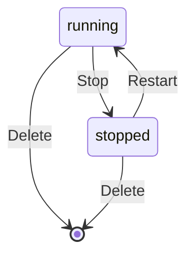
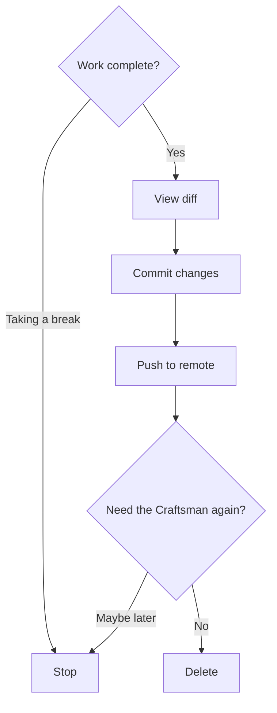

## Overview

When a Craftsman's work is done — or you need to free up resources — you can **stop** it (preserving the container for later) or **delete** it (removing the container and all data).



## Stopping a Craftsman

Stopping pauses the container without removing it. The repo, uncommitted changes, and tmux session are preserved. The container can be restarted later.

### Via the UI

1. Select the Craftsman in the sidebar
2. Click the **Stop** button in the top bar
3. Status changes to `stopped` (gray indicator)

### Via the API

```bash
curl -X POST http://localhost:7424/api/craftsmen/alice/stop
# → {"status": "stopped", ...}
```

```mermaid
sequenceDiagram
  participant U as You
  participant A as Workshop API
  participant D as Docker

  U->>A: POST /craftsmen/alice/stop
  A->>D: container.stop()
  A->>A: status → stopped
  A-->>U: 200 OK
  A-->>U: SSE event: stopped

  click A href "#" "server/src/routes/craftsmen.ts:73-85"
  click D href "#" "server/src/services/docker.ts:182-189"
```

## Restarting a Stopped Craftsman

A stopped Craftsman can be brought back. The container resumes with its previous state intact.

### Via the UI

1. Select the stopped Craftsman
2. Click the **Start** button

### Via the API

```bash
curl -X POST http://localhost:7424/api/craftsmen/alice/start
# → {"status": "running", ...}
```

```mermaid
sequenceDiagram
  participant U as You
  participant A as Workshop API
  participant D as Docker

  U->>A: POST /craftsmen/alice/start
  A->>D: container.start()
  A->>A: status → running
  A-->>U: 200 OK
  A-->>U: SSE event: running

  click A href "#" "server/src/routes/craftsmen.ts:87-99"
  click D href "#" "server/src/services/docker.ts:191-194"
```

## Deleting a Craftsman

Deleting permanently removes the Docker container and the Craftsman record from the database. **This is irreversible** — any uncommitted changes in the container are lost.

### Before deleting, save your work

If the Craftsman has uncommitted changes you want to keep:

1. Open the **Git** panel
2. **Commit** the changes
3. **Push** to the remote branch
4. Then delete the Craftsman

### Via the UI

1. Select the Craftsman
2. Click the **Delete** button
3. Confirm the deletion

### Via the API

```bash
curl -X DELETE http://localhost:7424/api/craftsmen/alice
# → {"ok": true}
```

```mermaid
sequenceDiagram
  participant U as You
  participant A as Workshop API
  participant D as Docker
  participant DB as SQLite

  U->>A: DELETE /craftsmen/alice
  A->>D: container.stop()
  A->>D: container.remove()
  A->>DB: DELETE FROM craftsmen
  A-->>U: 200 OK

  click A href "#" "server/src/routes/craftsmen.ts:101-112"
  click D href "#" "server/src/services/docker.ts:196-204"
```

## Recommended Workflow



**Stop** when you might need the Craftsman again — it preserves the environment and is faster to resume than creating a new one.

**Delete** when the work is finished and merged — it frees up resources and the port allocation.
