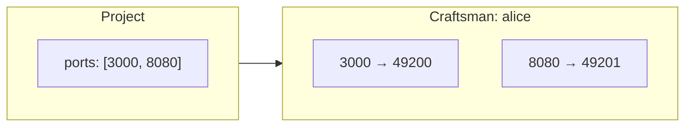
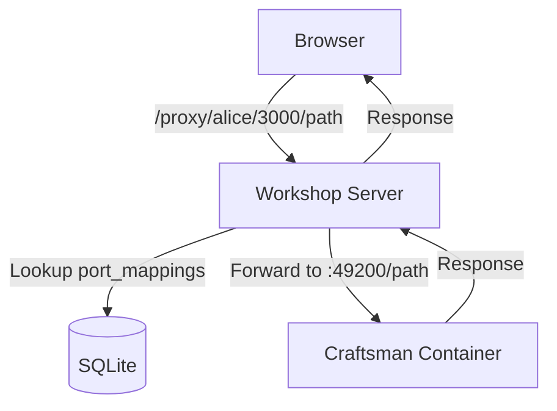
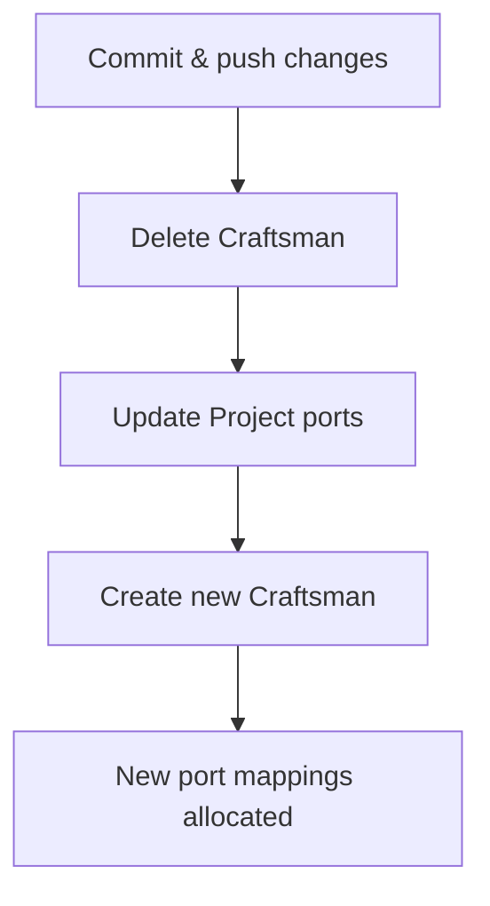
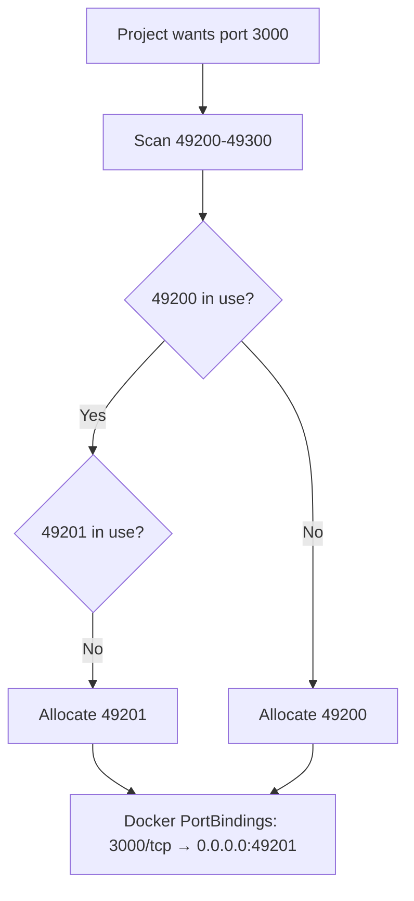

## How Port Forwarding Works

When a [Project](../key_concepts/project) defines `ports` (e.g. `[3000]`), each Craftsman assigned to that project gets those container ports mapped to unique host ports in the range **49200–49300**.



The mapping is determined at container creation time and stored in the Craftsman's `port_mappings` field as JSON:

```json
{"3000": 49200, "8080": 49201}
```

## Accessing Exposed Services

There are two ways to reach a service running inside a Craftsman container:

### 1. Direct host port

```
http://localhost:{hostPort}
```

For example, if `port_mappings` shows `{"3000": 49200}`:

```
http://localhost:49200
```

This works from your browser, curl, or any tool on the host machine.

### 2. Reverse proxy

```
http://localhost:7424/proxy/{craftsmanName}/{containerPort}/
```

For example:

```
http://localhost:7424/proxy/alice/3000/
```

The Workshop server proxies the request to the correct host port. This is what the **Preview** tab in the UI uses for embedded iframes.



## Checking Port Mappings

### Via the UI

Select a Craftsman — the **Preview** tab shows available ports and provides links.

### Via the API

```bash
curl http://localhost:7424/api/craftsmen/alice
# → {"port_mappings": "{\"3000\":49200}", ...}
```

Parse the `port_mappings` JSON string to get the mapping.

## Updating Ports

Port mappings are set when a Craftsman is created, based on the Project's `ports` field at that time. To change which ports are exposed:

### For new Craftsmen

Update the Project's `ports` field before creating a new Craftsman. New Craftsmen will use the updated port list.

### For existing Craftsmen

Port mappings cannot be changed on a running Craftsman. To update ports:

1. **Save your work** — commit and push any changes
2. **Delete** the Craftsman
3. **Update** the Project's port configuration
4. **Create** a new Craftsman



## Port Allocation Details

The server scans ports 49200–49300 sequentially, skipping any that are already in use by other active Craftsmen. Each container port gets its own unique host port.



The maximum number of mapped ports across all active Craftsmen is **101** (49200–49300 inclusive).

## Troubleshooting

**Port not reachable**: Ensure the service inside the container is binding to `0.0.0.0`, not `127.0.0.1`. Many dev servers default to localhost-only.

**Port conflict**: If you get a "no available ports" error, you've exhausted the 49200–49300 range. Delete unused Craftsmen to free up ports.

**Preview not loading**: The reverse proxy requires the Craftsman to be in `running` status. Check the Craftsman status and ensure the dev server is actually running inside the container.
