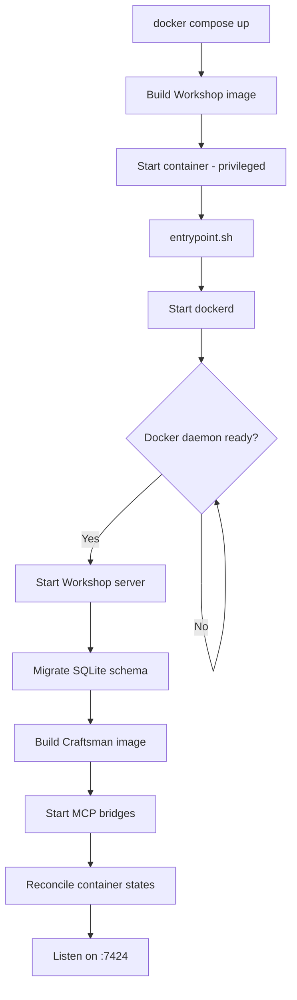
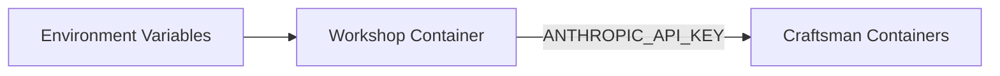

## Prerequisites

- **Docker** with Docker Compose v2 (`docker compose` command)
- **Anthropic API key** from [console.anthropic.com](https://console.anthropic.com)

That's it. Workshop runs entirely in Docker — no local Node.js, database, or other dependencies needed.

## Quick Start

### 1. Set your API key

```bash
export ANTHROPIC_API_KEY=sk-ant-...
```

### 2. Build and start

```bash
docker compose up --build
```

This builds the Workshop image (multi-stage: React client + DinD server) and starts the container in privileged mode.

### 3. Open the UI

Navigate to **http://localhost:7424** in your browser.

## What Happens on Startup



The first build of the Craftsman image takes a minute or two (installs Claude Code CLI). Subsequent starts reuse the cached image unless `Dockerfile.craftsman` changes.

## Environment Variables

| Variable | Default | Description |
|----------|---------|-------------|
| `ANTHROPIC_API_KEY` | _(required)_ | Passed into every Craftsman container |
| `WORKSHOP_PORT` | `7424` | Port the server listens on |
| `WORKSHOP_DB_PATH` | `./workshop.db` | SQLite database file location |

These are configured in `docker-compose.yml`:



## Exposed Ports

| Port(s) | Purpose |
|---------|---------|
| `7424` | Workshop API + web UI |
| `48100-48399` | MCP bridge SSE endpoints (host MCP servers forwarded to containers) |
| `49200-49300` | Allocated to Craftsman container ports |

## Persistent Volumes

| Volume | Mount point | Contents |
|--------|------------|----------|
| `docker-data` | `/var/lib/docker` | Inner Docker daemon state — images, containers |
| `workshop-data` | `/data` | SQLite database |

Data persists across `docker compose down` / `up` cycles. To fully reset, remove the volumes:

```bash
docker compose down -v
```

## MCP Server Forwarding

If you have MCP servers configured in your host `~/.claude.json`, Workshop automatically bridges them into Craftsman containers. The host config file is mounted read-only into the Workshop container.

To update MCP auth tokens without restarting Workshop, use the **Resync MCP Auth** button in Settings or call:

```bash
curl -X POST http://localhost:7424/api/mcp/restart
```

See [MCP Bridges](../key_concepts/mcp_bridges) for details on how this works.

## Development Setup

For working on Workshop itself, run the server and client separately:

```bash
# Terminal 1: Server (requires Docker daemon access)
cd server
npm install
npm run dev    # tsx watch mode, auto-reloads

# Terminal 2: React client (Vite dev server with HMR)
cd client
npm install
npm run dev    # http://localhost:5173, proxies /api to :7424
```

The client dev server proxies API requests to `localhost:7424`, so both can run simultaneously.

## Verifying the Installation

Once Workshop is running, check the health endpoint:

```bash
curl http://localhost:7424/api/health
# -> {"status":"ok"}
```

Then open **http://localhost:7424** in your browser. You should see the Workshop UI with an empty Craftsmen sidebar. Next step: [create a Project and hire your first Craftsman](developing_a_project).
