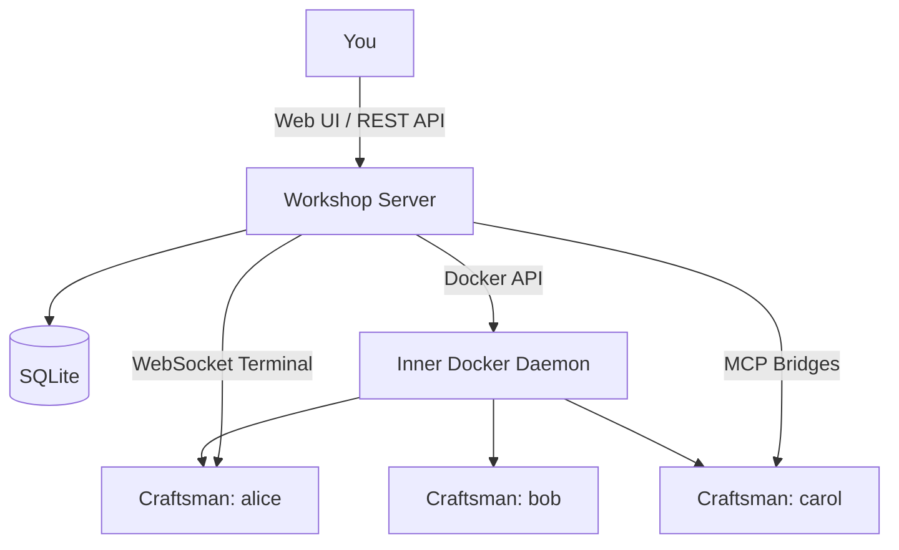

## What is Workshop?

Workshop is a system for managing **Craftsmen** — isolated Docker containers running [Claude Code](https://claude.ai) that work autonomously on GitHub repositories. You create a Project, hire a Craftsman, give it instructions, and manage the results through a built-in git workflow.

Everything runs inside a single Docker-in-Docker container. The Workshop server orchestrates Craftsman containers, exposes a REST API, and serves a React web UI — all on port `7424`.

## How It Works



## Core Concepts

| Concept | What it is |
|---------|-----------|
| [**Workshop**](key_concepts/architecture) | The Docker-in-Docker server that runs everything — API, UI, and inner Docker daemon. |
| [**Craftsman**](key_concepts/craftsman) | A named Docker container with Claude Code, git, and tmux. Does the actual coding work. |
| [**Project**](key_concepts/project) | A GitHub repository configuration — repo URL, branch, setup command, and ports to expose. |
| [**MCP Bridges**](key_concepts/mcp_bridges) | Per-craftsman supergateway processes that forward host MCP servers into containers. |

## Quick Start

```bash
export ANTHROPIC_API_KEY=sk-ant-...
docker compose up --build
# Open http://localhost:7424
```

## Documentation

### Key Concepts

- [Architecture](key_concepts/architecture) — Docker-in-Docker, networking, and system design
- [Craftsman](key_concepts/craftsman) — What Craftsmen are and how they work
- [Project](key_concepts/project) — Configuring GitHub repositories as Projects
- [MCP Bridges](key_concepts/mcp_bridges) — Forwarding host MCP servers into Craftsman containers

### How-To Guides

- [Workshop Setup](how_tos/craftsman_setup) — Prerequisites, installation, and first run
- [Developing a Project](how_tos/developing_a_project) — End-to-end development workflow with Craftsmen

### Workflows

- [Creating a Craftsman](workflows/creating_a_craftsman) — Hire a Craftsman via the UI or API
- [Assigning a Task](workflows/assigning_a_task) — Create a Craftsman with an automated task
- [Relieving a Craftsman](workflows/relieving_a_craftsman) — Stop, rebuild, and remove a Craftsman
- [Port Forwarding](workflows/update_craftsman_port_forwarding) — Manage exposed ports and direct host access
