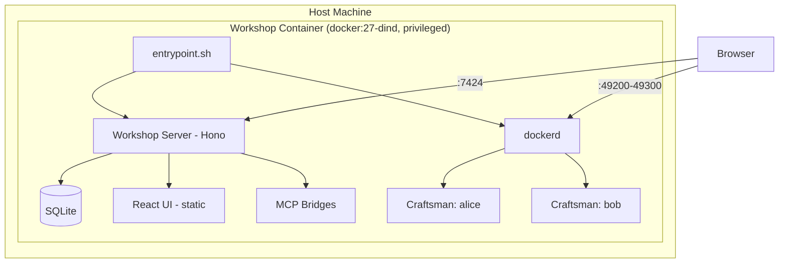
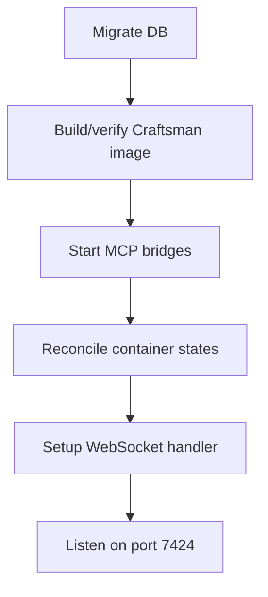
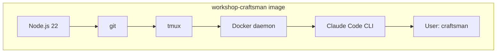
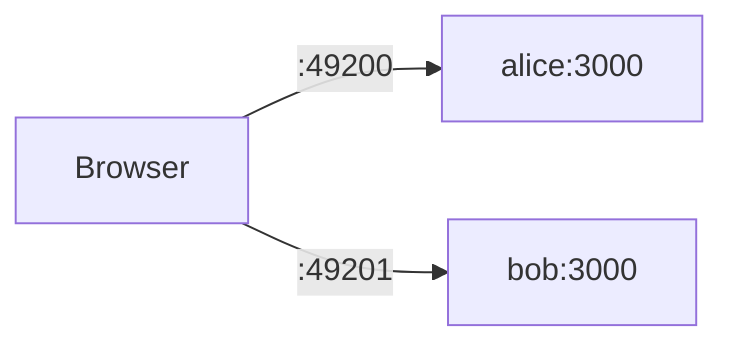
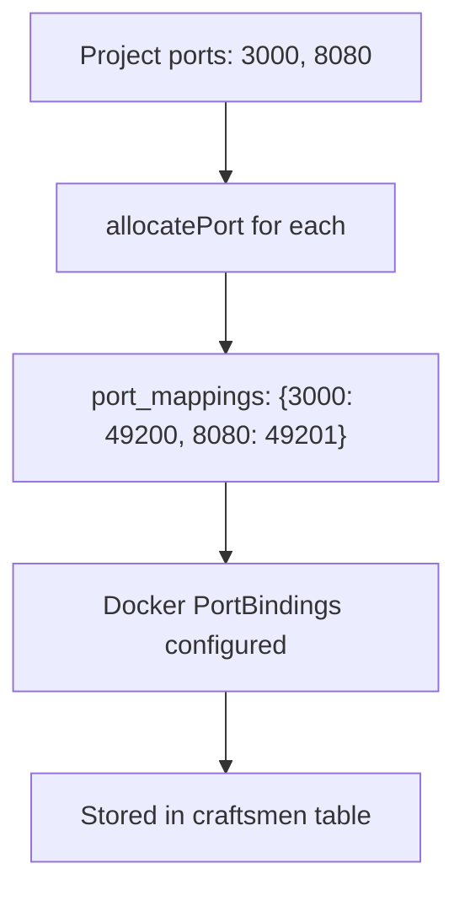

## Overview

Workshop runs as a single Docker container that hosts its own Docker daemon inside it (Docker-in-Docker). This inner daemon spawns and manages Craftsman containers. The Workshop server, React UI, SQLite database, and inner Docker daemon all live in one outer container.



## Docker-in-Docker (DinD)

The Workshop container uses `docker:27-dind` as its base image and runs in **privileged mode**. On startup, `entrypoint.sh` starts `dockerd` in the background, waits for it to become ready, then launches the Workshop server.

```mermaid
sequenceDiagram
  participant E as entrypoint.sh
  participant D as dockerd
  participant S as Workshop Server

  E->>D: Start daemon (background)
  loop Wait for ready
    E->>D: docker info
    D-->>E: Not ready / Ready
  end
  E->>S: exec tsx src/index.ts

  click E href "#" "server/entrypoint.sh"
  click S href "#" "server/src/index.ts:11-28"
```

Two Docker volumes persist state across restarts:

| Volume | Mount | Purpose |
|--------|-------|---------|
| `docker-data` | `/var/lib/docker` | Inner Docker daemon state (images, containers) |
| `workshop-data` | `/data` | SQLite database |

## Server Initialization

When the Workshop server starts, it runs through this sequence:



**Reconciliation** ensures that if a Craftsman container died while the server was down, its database status is updated to `stopped`.

## Craftsman Containers

Each Craftsman runs in its own container built from `Dockerfile.craftsman`:



The image is built once on server startup and cached using a SHA256 hash of the Dockerfile. If the Dockerfile changes, the image is rebuilt automatically.

Key characteristics:
- **Non-root**: Runs as the `craftsman` user with passwordless sudo
- **Pre-configured**: Claude Code onboarding is skipped via `~/.claude.json`
- **Docker-in-Docker**: Each container runs its own `dockerd` for Claude Code tool use
- **Long-lived**: A craftsman entrypoint script starts dockerd, then `tail -f /dev/null` keeps the container alive
- **API key injected**: `ANTHROPIC_API_KEY` is passed as an environment variable at container creation

## Networking & Port Forwarding

Craftsman containers can expose ports (e.g. 3000 for a dev server). Workshop allocates host ports from the range **49200–49300** and maps them to container ports.



Each port is accessed directly via the allocated host port:

```
http://localhost:{hostPort}
```

The **Preview** tab in the UI uses these direct host port URLs to embed iframes of running services.

### Port Allocation

When a Craftsman is created, the server allocates one host port per container port by scanning the 49200–49300 range for unused ports. The mapping is stored in the database as JSON. Ports that recently caused conflicts are temporarily excluded.



### MCP Bridge Ports

MCP bridges use a separate port range: **48100–48399**. These ports allow Craftsman containers to reach host MCP servers via SSE. See [MCP Bridges](mcp_bridges) for details.

## Terminal Access

Each Craftsman gets a tmux session (`main`) in `/workspace/project`. The web UI connects via WebSocket for an interactive terminal:

```mermaid
sequenceDiagram
  participant B as Browser (xterm.js)
  participant W as WebSocket Server
  participant D as Docker exec
  participant T as tmux (in container)

  B->>W: Upgrade /api/craftsmen/:id/terminal
  W->>D: exec tmux new-session -A -s main
  D->>T: Attach to session
  loop Interactive I/O
    B->>W: Keystrokes (binary)
    W->>D: Write to stream
    D->>T: Input
    T-->>D: Output
    D-->>W: Read from stream
    W-->>B: Terminal output (binary)
  end
  B->>W: {"type":"resize","cols":120,"rows":40}
  W->>D: exec.resize()

  click W href "#" "server/src/services/websocket.ts:8-56"
  click D href "#" "server/src/services/terminal.ts:4-24"
```

The `-A` flag on `tmux new-session` reattaches to an existing session if one exists, so multiple terminal connections share the same tmux session.

## Real-Time Events

Workshop uses **Server-Sent Events (SSE)** instead of polling for status changes and container logs:

| Endpoint | Purpose |
|----------|---------|
| `GET /api/craftsmen/:id/events` | Status transitions (`starting` → `running`, etc.) |
| `GET /api/craftsmen/:id/logs` | Container stdout/stderr stream |

An in-process `EventEmitter` broadcasts status changes to all connected SSE clients.

## Git Workflow

Git operations run inside the Craftsman container via `docker exec`:


Pushes go to a `craftsman/{name}` branch. PRs are opened via the GitHub API using the project's stored token.
