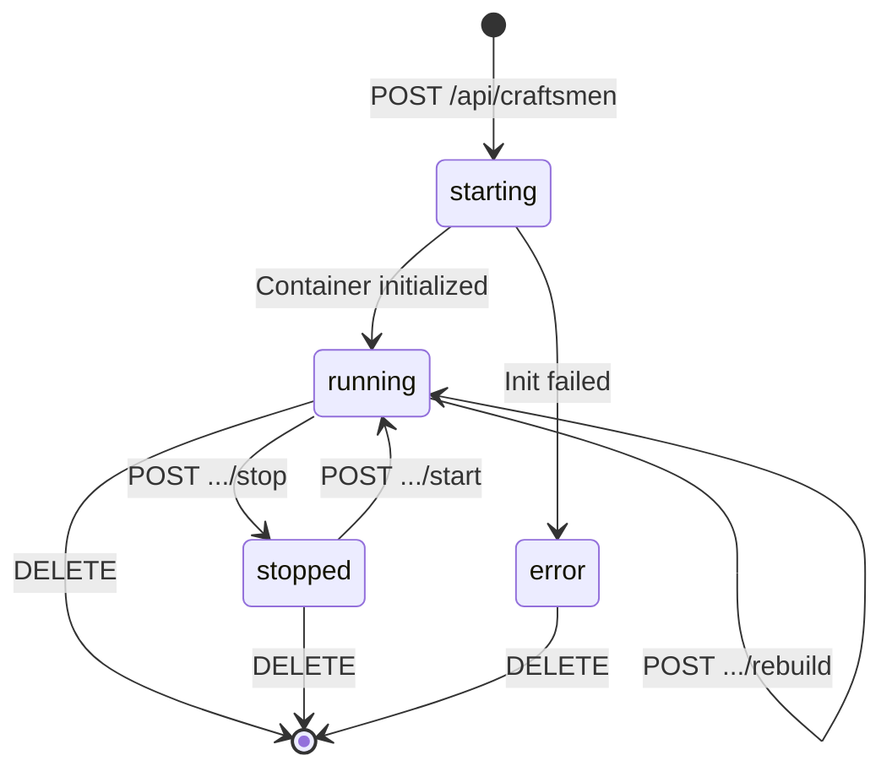
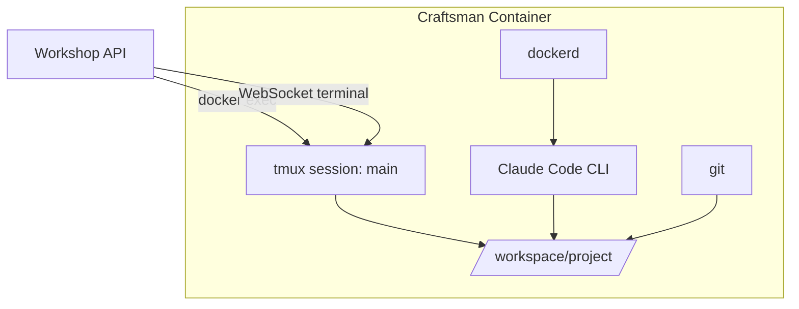
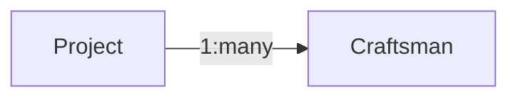

## What is a Craftsman?

A Craftsman is a named Docker container that runs Claude Code and works on a [Project](project). Each Craftsman gets its own isolated environment with git, tmux, a Docker daemon, and a full Node.js runtime. You give it a name (e.g. "alice"), assign it to a Project, and it clones the repo and starts working.

Craftsmen are the workers in Workshop — you "hire" them to build features, fix bugs, or run tasks.

## Lifecycle

A Craftsman moves through these statuses:



| Status | Meaning |
|--------|---------|
| `starting` | Container is being created, repo cloned, setup command running |
| `running` | Ready to accept terminal sessions and commands |
| `stopped` | Container paused — can be restarted |
| `error` | Startup failed — check `error_message` for details |

## What's Inside a Craftsman Container

Each container is built from the Craftsman image and includes:

- **Node.js 22** runtime
- **git** for repo operations
- **tmux** for persistent terminal sessions
- **Docker daemon** for Claude Code tool use (Docker-in-Docker)
- **Claude Code CLI** pre-installed globally
- **`ANTHROPIC_API_KEY`** injected at runtime



The workspace lives at `/workspace/project` inside the container. The tmux session named `main` is started in that directory automatically.

## Container Naming

Docker containers follow the pattern `workshop-craftsman-{name}`. A Craftsman named "alice" runs in a container called `workshop-craftsman-alice`.

## Data Model



Key fields stored in the database:

| Field | Description |
|-------|-------------|
| `name` | Unique name (used in API URLs and container name) |
| `project_id` | The Project this Craftsman works on |
| `container_id` | Docker container ID (set once running) |
| `status` | Current lifecycle state |
| `session_id` | Claude Code session ID for conversation continuity |
| `port_mappings` | JSON mapping container ports to host ports (e.g. `{"3000": 49200}`) |
| `task` | Optional task description — if set, Claude Code starts working on it automatically |

## Async Startup

When you create a Craftsman via `POST /api/craftsmen`, the API returns immediately with status `starting`. The actual container creation and initialization runs in the background:

1. Create Docker container with port bindings
2. Wait for inner Docker daemon readiness
3. Configure Claude Code MCP servers
4. Clone the project's git repo
5. Run the project's setup command (e.g. `npm install`)
6. Start a tmux session in `/workspace/project`
7. If a task was provided, start Claude Code with the task
8. Status transitions to `running`

Subscribe to `GET /api/craftsmen/:id/events` (SSE) to be notified when the Craftsman is ready.

```mermaid
sequenceDiagram
  participant U as User
  participant A as API
  participant D as Docker

  U->>A: POST /api/craftsmen
  A-->>U: 201 { status: "starting" }
  A->>D: createContainer()
  A->>D: initContainer()
  D-->>A: Done
  A->>A: status -> "running"
  A-->>U: SSE event: running

  click A href "#" "server/src/routes/craftsmen.ts:19-67"
  click D href "#" "server/src/services/docker.ts:85-140"
```

## Rebuild

A running Craftsman can be rebuilt without re-cloning the repo. This creates a fresh container but preserves the `/workspace` directory. Useful when the Craftsman image changes or the container enters a bad state.

```bash
curl -X POST http://localhost:7424/api/craftsmen/alice/rebuild
```

```mermaid
sequenceDiagram
  participant U as User
  participant A as API
  participant D as Docker

  U->>A: POST /craftsmen/alice/rebuild
  A->>D: Remove old container
  A->>D: Create new container (same workspace)
  A->>D: initContainer (skip clone)
  D-->>A: Done
  A->>A: status -> "running"
  A-->>U: SSE event: running

  click A href "#" "server/src/routes/craftsmen.ts:109-139"
  click D href "#" "server/src/services/docker.ts:243-259"
```

## Tasks

A Craftsman can be created with a **task** — a text description of work to do. When a task is set, Claude Code starts automatically in the tmux session and begins working on the task without manual intervention.

```bash
curl -X POST http://localhost:7424/api/craftsmen \
  -H "Content-Type: application/json" \
  -d '{"name": "fixer", "project_id": "abc-123", "task": "Fix the login bug in auth.ts"}'
```

See [Assigning a Task](../workflows/assigning_a_task) for the full workflow.
