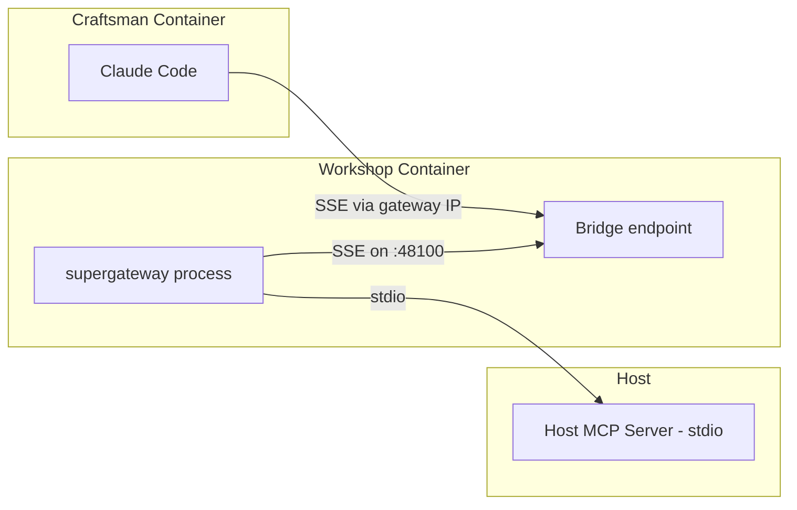
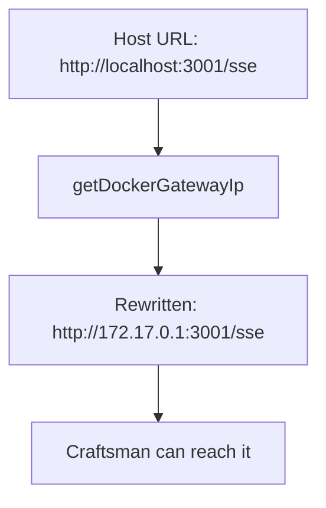
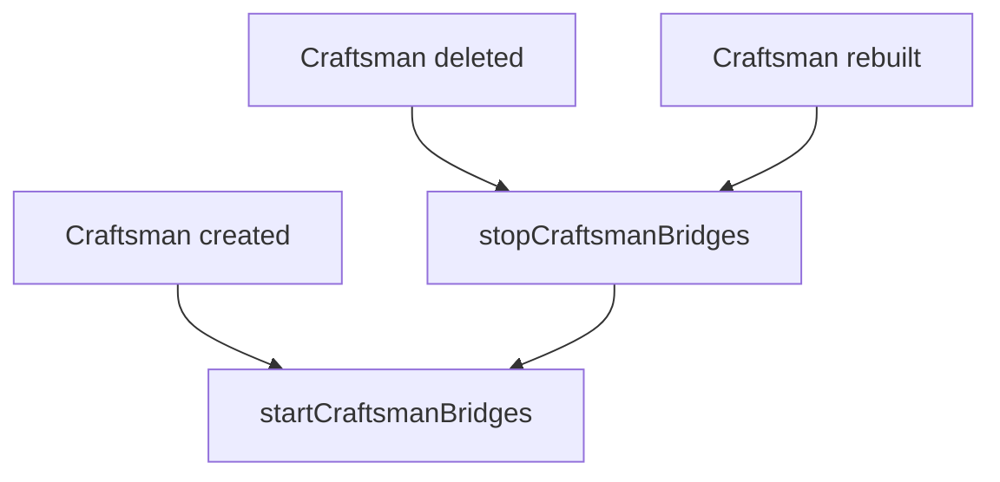

## What are MCP Bridges?

MCP (Model Context Protocol) Bridges let Craftsman containers access MCP servers running on the host machine. Since each Craftsman runs inside a nested Docker container, it can't directly reach stdio-based MCP servers on the host. Workshop solves this by running **supergateway** processes that bridge stdio MCP servers to SSE endpoints reachable from inside containers.



## How It Works

### Host Configuration

Workshop reads MCP server definitions from the host's Claude configuration file, mounted at `/host-claude-config/claude.json` inside the Workshop container. This file is the standard Claude Code `~/.claude.json` from the host machine.

```mermaid
flowchart TD
  A[Host ~/.claude.json] -->|Docker volume mount| B[/host-claude-config/claude.json]
  B --> C[readHostMcpConfig]
  C --> D{Server type?}
  D -->|stdio| E[Start supergateway bridge]
  D -->|sse| F[Passthrough URL directly]

  click B href "#" "docker-compose.yml:18-18"
  click C href "#" "server/src/services/mcp-bridge.ts:63-90"
  click E href "#" "server/src/services/mcp-bridge.ts:135-178"
  click F href "#" "server/src/services/mcp-bridge.ts:251-277"
```

Two types of MCP servers are handled differently:

| Type | Handling | How |
|------|----------|-----|
| **stdio** | Bridged via supergateway | A dedicated process per server per craftsman converts stdio to SSE |
| **sse** | Passthrough | The URL is rewritten to use the Docker gateway IP and passed directly |

### Per-Craftsman Bridges

Each Craftsman gets its own set of bridge processes. When a Craftsman is created, Workshop:

1. Reads the host MCP config
2. For each stdio server, spawns a `supergateway` process on a unique port (48100–48399)
3. For each SSE server, rewrites `localhost` URLs to the Docker bridge gateway IP
4. Writes the MCP server configuration into the Craftsman's Claude Code config

```mermaid
sequenceDiagram
  participant I as initContainer
  participant B as MCP Bridge Service
  participant SG as supergateway
  participant C as Craftsman Container

  I->>B: startCraftsmanBridges(id)
  B->>B: Read host MCP config
  loop For each stdio server
    B->>SG: Spawn on port 48100+N
    SG-->>B: Listening
  end
  B->>B: getBridgeUrls(id)
  B-->>I: MCP server URLs
  I->>C: Write claude.json with MCP config

  click I href "#" "server/src/services/docker.ts:155-195"
  click B href "#" "server/src/services/mcp-bridge.ts:201-229"
  click SG href "#" "server/src/services/mcp-bridge.ts:135-178"
```

### Docker Gateway IP

SSE URLs pointing to `localhost` or `127.0.0.1` on the host won't work from inside a container. Workshop detects the Docker bridge gateway IP (typically `172.17.0.1`) and rewrites URLs accordingly.



## Port Range

MCP bridges use ports **48100–48399** (up to 300 bridges). These ports are exposed in `docker-compose.yml` so that Craftsman containers can reach them.

| Range | Purpose |
|-------|---------|
| 48100–48399 | MCP bridge SSE endpoints |
| 49200–49300 | Craftsman container port forwarding |

## Bridge Lifecycle

Bridges are started when a Craftsman is created and stopped when it's deleted or rebuilt. On rebuild, old bridges are cleaned up and new ones are started.



All bridges can be restarted at once (e.g. after updating auth tokens) via:

```bash
curl -X POST http://localhost:7424/api/mcp/restart
```

## Monitoring

The MCP status endpoint shows all host servers and active bridges:

```bash
curl http://localhost:7424/api/mcp/servers
```

Returns:

```json
{
  "hostServers": [
    {"name": "linear", "type": "stdio", "command": "npx @anthropic/linear-mcp"}
  ],
  "activeBridges": [
    {"name": "linear", "craftsmanId": "abc-123", "type": "bridge", "status": "running", "port": 48100, "url": "http://172.17.0.1:48100/sse"}
  ]
}
```

The Settings pane in the web UI also displays this information with status indicators for each bridge.
