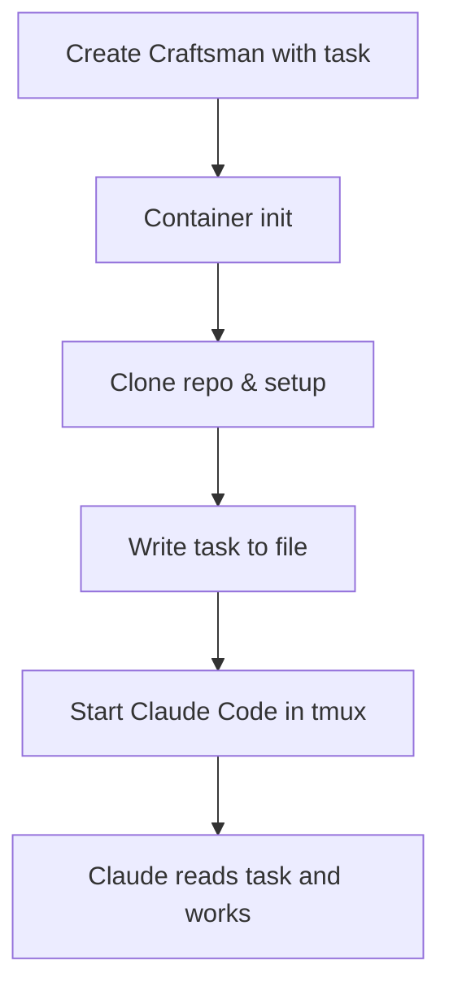
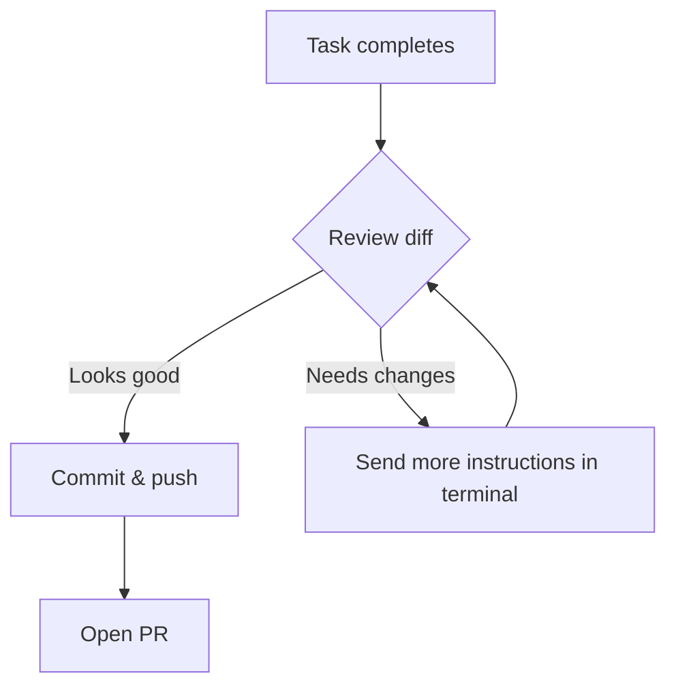

## Overview

A **task** is a text description of work you want done. When you create a Craftsman with a task, the normal initialization happens (container creation, repo clone, setup), and then Claude Code launches automatically in the tmux session and starts working on the task — no manual interaction needed.



## Via the Web UI

1. Click **New Task** in the sidebar
2. Select the Project from the dropdown
3. Enter the task description (e.g. "Fix the login bug in auth.ts and add tests")
4. Click **Create**

A unique name is auto-generated (e.g. `task-20260306-1430-a3f2`). The modal shows live startup logs and closes when the Craftsman reaches `running` status.

## Via the API

```bash
curl -X POST http://localhost:7424/api/craftsmen \
  -H "Content-Type: application/json" \
  -d '{
    "name": "fix-auth",
    "project_id": "abc-123",
    "task": "Fix the login bug in auth.ts. The issue is that the token validation skips expired tokens. Add a test to verify the fix."
  }'
```

The `task` field is optional on the create endpoint. When present, it triggers the automated workflow.

## What Happens Behind the Scenes

```mermaid
sequenceDiagram
  participant U as You
  participant A as Workshop API
  participant D as Docker
  participant T as tmux
  participant CC as Claude Code

  U->>A: POST /api/craftsmen {name, project_id, task}
  A->>D: createContainer()
  A->>D: initContainer() (clone, setup)
  A->>D: Write task to /tmp/task.md
  A->>T: tmux send-keys "claude -p ... < /tmp/task.md"
  T->>CC: Claude Code starts
  CC->>CC: Reads task, begins working
  A-->>U: SSE event: running

  click A href "#" "server/src/routes/craftsmen.ts:19-67"
  click D href "#" "server/src/services/docker.ts:155-236"
  click T href "#" "server/src/services/docker.ts:524-547"
```

### Task execution flow

1. **Normal init** — container creation, dockerd wait, MCP config, repo clone, setup command
2. **Write task file** — the task text is written to `/tmp/task.md` inside the container
3. **Launch Claude Code** — a `claude` command is sent to the tmux session, reading from the task file with `--dangerously-skip-permissions`
4. **Status update** — the Craftsman moves to `running` status

Claude Code then works autonomously — editing files, running commands, and iterating until the task is complete.

## Monitoring Task Progress

### Terminal

Open the Craftsman's **Terminal** tab to see Claude Code working in real time. The terminal shows the tmux session where Claude is active.

### Logs

The **Logs** tab streams container output, which includes Claude Code's activity log.

### Git diff

Once Claude finishes working, check the **Git** panel to see what changed:

```bash
curl http://localhost:7424/api/craftsmen/fix-auth/diff
```

## After the Task Completes

Claude Code will finish and return to a shell prompt in the tmux session. From there:

1. **Review the work** — check the diff, run tests via the terminal
2. **Iterate** — type more instructions in the terminal if adjustments are needed
3. **Ship it** — commit, push, and open a PR via the Git panel



## Tips

- **Be specific** — detailed tasks produce better results. Include file paths, expected behavior, and edge cases.
- **One task per Craftsman** — each Craftsman works on one task. For parallel tasks, create multiple Craftsmen.
- **Check MCP servers** — if your task needs external context (Linear issues, Notion docs), make sure the relevant [MCP bridges](../key_concepts/mcp_bridges) are running.
