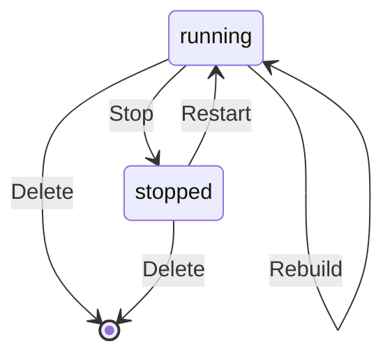
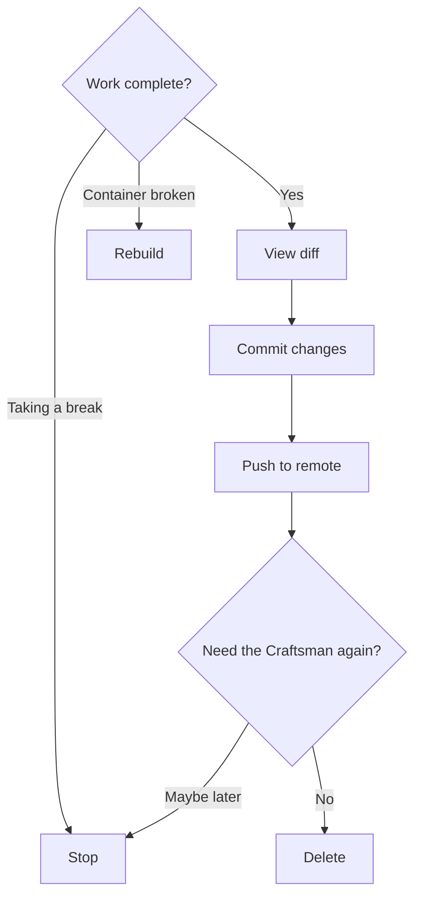

## Overview

When a Craftsman's work is done — or you need to free up resources — you can **stop** it (preserving the container for later), **rebuild** it (fresh container, same workspace), or **delete** it (removing everything).



## Stopping a Craftsman

Stopping pauses the container without removing it. The repo, uncommitted changes, and tmux session are preserved. The container can be restarted later.

### Via the UI

1. Select the Craftsman in the sidebar
2. Click the **Stop** button in the top bar
3. Status changes to `stopped` (gray indicator)

### Via the API

```bash
curl -X POST http://localhost:7424/api/craftsmen/alice/stop
# -> {"status": "stopped", ...}
```

```mermaid
sequenceDiagram
  participant U as You
  participant A as Workshop API
  participant D as Docker

  U->>A: POST /craftsmen/alice/stop
  A->>D: container.stop()
  A->>A: status -> stopped
  A-->>U: 200 OK
  A-->>U: SSE event: stopped

  click A href "#" "server/src/routes/craftsmen.ts:80-93"
  click D href "#" "server/src/services/docker.ts:370-377"
```

## Restarting a Stopped Craftsman

A stopped Craftsman can be brought back. The container resumes with its previous state intact — workspace, tmux session, and all.

### Via the UI

1. Select the stopped Craftsman
2. Click the **Start** button

### Via the API

```bash
curl -X POST http://localhost:7424/api/craftsmen/alice/start
# -> {"status": "running", ...}
```

```mermaid
sequenceDiagram
  participant U as You
  participant A as Workshop API
  participant D as Docker

  U->>A: POST /craftsmen/alice/start
  A->>D: container.start()
  A->>D: Wait for inner dockerd
  A->>D: Restart tmux session
  A->>A: status -> running
  A-->>U: 200 OK
  A-->>U: SSE event: running

  click A href "#" "server/src/routes/craftsmen.ts:95-107"
  click D href "#" "server/src/services/docker.ts:379-396"
```

## Rebuilding a Craftsman

Rebuild creates a fresh container but preserves the `/workspace` directory (your code changes are kept). This is useful when:

- The Craftsman image has been updated
- The container is in a bad state
- MCP bridges need to be re-initialized

### Via the UI

1. Select the running Craftsman
2. Click the **Rebuild** button

### Via the API

```bash
curl -X POST http://localhost:7424/api/craftsmen/alice/rebuild
```

```mermaid
sequenceDiagram
  participant U as You
  participant A as Workshop API
  participant D as Docker
  participant MB as MCP Bridges

  U->>A: POST /craftsmen/alice/rebuild
  A->>A: status -> starting
  A->>MB: stopCraftsmanBridges()
  A->>D: Remove old container
  A->>D: Create new container (same workspace volume)
  A->>D: initContainer (skip clone)
  A->>MB: startCraftsmanBridges()
  A->>A: status -> running
  A-->>U: SSE event: running

  click A href "#" "server/src/routes/craftsmen.ts:109-139"
  click D href "#" "server/src/services/docker.ts:243-259"
  click MB href "#" "server/src/services/mcp-bridge.ts:234-245"
```

## Deleting a Craftsman

Deleting permanently removes the Docker container, the workspace directory, and the Craftsman record from the database. **This is irreversible** — any uncommitted changes in the container are lost.

### Before deleting, save your work

If the Craftsman has uncommitted changes you want to keep:

1. Open the **Git** panel
2. **Commit** the changes
3. **Push** to the remote branch
4. Then delete the Craftsman

### Via the UI

1. Select the Craftsman
2. Click the **Relieve** button
3. Confirm the deletion

### Via the API

```bash
curl -X DELETE http://localhost:7424/api/craftsmen/alice
# -> {"ok": true}
```

```mermaid
sequenceDiagram
  participant U as You
  participant A as Workshop API
  participant D as Docker
  participant DB as SQLite
  participant MB as MCP Bridges

  U->>A: DELETE /craftsmen/alice
  A->>MB: stopCraftsmanBridges()
  A->>D: container.stop()
  A->>D: container.remove()
  A->>D: Delete workspace directory
  A->>DB: DELETE FROM craftsmen
  A-->>U: 200 OK

  click A href "#" "server/src/routes/craftsmen.ts:141-153"
  click D href "#" "server/src/services/docker.ts:398-411"
  click MB href "#" "server/src/services/mcp-bridge.ts:234-245"
```

## Recommended Workflow



**Stop** when you might need the Craftsman again — it preserves the environment and is faster to resume than creating a new one.

**Rebuild** when the container is broken but the code is fine — it keeps your workspace while creating a fresh container environment.

**Delete** when the work is finished and merged — it frees up resources and the port allocation.
