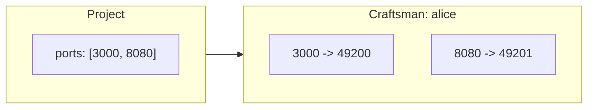
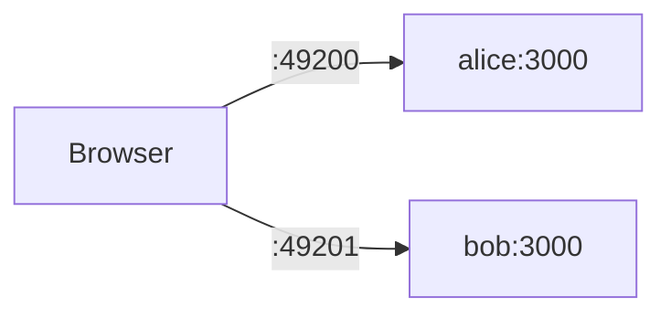
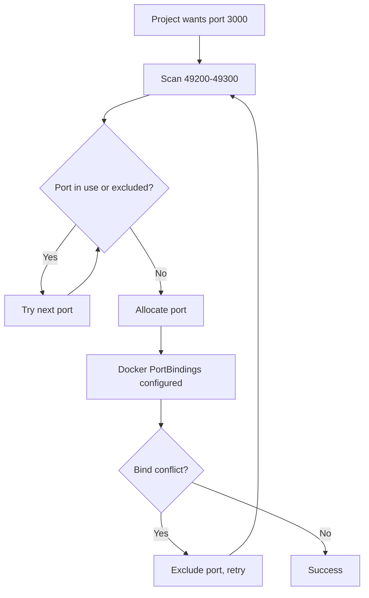

## How Port Forwarding Works

When a [Project](../key_concepts/project) defines `ports` (e.g. `[3000]`), each Craftsman assigned to that project gets those container ports mapped to unique host ports in the range **49200–49300**.



The mapping is determined at container creation time and stored in the Craftsman's `port_mappings` field as JSON:

```json
{"3000": 49200, "8080": 49201}
```

## Accessing Exposed Services

Each mapped port is accessed directly via the allocated host port:

```
http://localhost:{hostPort}
```

For example, if `port_mappings` shows `{"3000": 49200}`:

```
http://localhost:49200
```

This works from your browser, curl, or any tool on the host machine. The **Preview** tab in the UI uses these direct host port URLs to embed iframes of running services.



## Checking Port Mappings

### Via the UI

Select a Craftsman — the **Preview** tab shows available ports and provides links.

### Via the API

```bash
curl http://localhost:7424/api/craftsmen/alice
# -> {"port_mappings": "{\"3000\":49200}", ...}
```

Parse the `port_mappings` JSON string to get the mapping.

## Updating Ports

### Live update via PATCH (recommended)

You can update a Project's ports on-the-fly. Running Craftsmen are automatically recreated with new port mappings — the workspace is preserved.

```bash
curl -X PATCH http://localhost:7424/api/projects/abc-123 \
  -H "Content-Type: application/json" \
  -d '{"ports": [3000, 8080]}'
```

```mermaid
sequenceDiagram
  participant U as You
  participant A as Workshop API
  participant D as Docker

  U->>A: PATCH /api/projects/:id {ports: [3000, 8080]}
  A->>A: Update project in DB
  loop For each running Craftsman
    A->>D: recreateContainerWithPorts()
    Note over D: Stop old container
    Note over D: Create new with updated ports
    Note over D: Preserve workspace volume
    D-->>A: New container running
  end
  A-->>U: 200 OK (updated project)

  click A href "#" "server/src/routes/projects.ts:39-82"
  click D href "#" "server/src/services/docker.ts:297-368"
```

In the UI, you can click on a Project's ports in the Settings pane to edit them inline.

### Manual recreation

If the PATCH approach isn't suitable:

1. **Save your work** — commit and push any changes
2. **Delete** the Craftsman
3. **Update** the Project's port configuration
4. **Create** a new Craftsman

## Port Allocation Details

The server scans ports 49200–49300 sequentially, skipping any that are already in use by other active Craftsmen. Ports that recently caused bind conflicts are temporarily excluded. Each container port gets its own unique host port.



The maximum number of mapped ports across all active Craftsmen is **101** (49200–49300 inclusive). The server retries up to 5 times on port bind conflicts.

## Troubleshooting

**Port not reachable**: Ensure the service inside the container is binding to `0.0.0.0`, not `127.0.0.1`. Many dev servers default to localhost-only.

**Port conflict**: If you get a "no available ports" error, you've exhausted the 49200–49300 range. Delete unused Craftsmen to free up ports.

**Preview not loading**: The Craftsman must be in `running` status. Check the Craftsman status and ensure the dev server is actually running inside the container.
